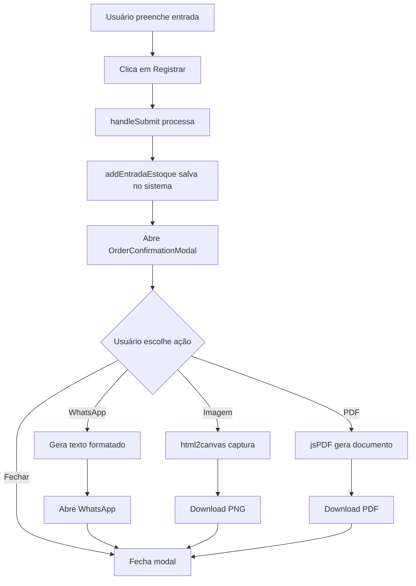

# Design Document - Envio de Pedido para Fábrica

## Overview

Esta funcionalidade adiciona um modal de confirmação após o registro de entrada de estoque, permitindo que o usuário envie o pedido para a fábrica através de WhatsApp (texto), imagem PNG ou PDF. O design reutiliza componentes e padrões já existentes no sistema (similar ao componente Reports.tsx) para manter consistência.

## Architecture

### Component Structure

```
Stock.tsx (existente)
├── AddStockModal (existente - modificado)
│   └── Após handleSubmit bem-sucedido
│       └── Abre OrderConfirmationModal (novo)
│
OrderConfirmationModal (novo componente)
├── Header (logo, título, data)
├── OrderSummary (lista de produtos)
├── Totals (totalizadores)
├── ExportButtons (WhatsApp, Imagem, PDF)
└── Footer (botão fechar)
```

### Data Flow



## Components and Interfaces

### 1. OrderConfirmationModal Component

**Props:**
```typescript
interface OrderConfirmationModalProps {
    produtos: ItemEntrada[];
    fornecedor: string;
    dataRegistro: Date;
    onClose: () => void;
}

interface ItemEntrada {
    id: string;
    produtoId: string;
    quantidade: number;
}
```

**State:**
```typescript
const [isExporting, setIsExporting] = useState(false);
const [exportType, setExportType] = useState<'whatsapp' | 'image' | 'pdf' | null>(null);
const orderRef = useRef<HTMLDivElement>(null);
```

**Responsibilities:**
- Exibir resumo do pedido
- Gerar mensagem WhatsApp formatada
- Capturar conteúdo como imagem
- Gerar PDF do pedido
- Gerenciar estado de exportação

### 2. OrderSummary Component (interno)

**Props:**
```typescript
interface OrderSummaryProps {
    produtos: ItemEntrada[];
    fornecedor: string;
    dataRegistro: Date;
    produtosData: Produto[]; // do contexto
}
```

**Responsibilities:**
- Renderizar lista de produtos
- Mostrar quantidades
- Calcular e mostrar totais
- Formatar data/hora

### 3. Modificações no AddStockModal

**Mudanças necessárias:**
```typescript
// Estado adicional
const [showConfirmation, setShowConfirmation] = useState(false);
const [registeredItems, setRegisteredItems] = useState<ItemEntrada[]>([]);
const [registeredDate, setRegisteredDate] = useState<Date>(new Date());

// Modificar handleSubmit
const handleSubmit = () => {
    // Salvar dados antes de registrar
    const itemsToRegister = itensEntrada.length > 0 ? itensEntrada : [{
        id: Date.now().toString(),
        produtoId,
        quantidade
    }];
    
    const registrationDate = new Date();
    
    // Registrar no sistema
    itemsToRegister.forEach(item => {
        addEntradaEstoque({
            produtoId: item.produtoId,
            quantidade: item.quantidade,
            fornecedor,
            dataRecebimento: registrationDate
        });
    });
    
    // Preparar dados para confirmação
    setRegisteredItems(itemsToRegister);
    setRegisteredDate(registrationDate);
    setShowConfirmation(true);
};

// Função para fechar tudo
const handleCloseAll = () => {
    setShowConfirmation(false);
    onClose(); // Fecha o modal de entrada também
};
```

## Data Models

### Pedido para Fábrica

```typescript
interface PedidoFabrica {
    data: Date;
    fornecedor: string;
    produtos: ProdutoPedido[];
    totalProdutos: number;
    totalUnidades: number;
}

interface ProdutoPedido {
    nome: string;
    tamanhoPacote: string;
    quantidade: number;
}
```

### Formato da Mensagem WhatsApp

```
*PEDIDO PARA FABRICA - MANA*
================================
*Data:* 20/10/2025 14:30
*Fornecedor:* Fábrica Matriz

*PRODUTOS SOLICITADOS:*
================================

*Biscoito Polvilho 1kg*
  Quantidade: *50 unidades*

*Pão de Queijo 1kg*
  Quantidade: *30 unidades*

*Biscoito de Queijo 5kg*
  Quantidade: *20 unidades*

================================
*Total:* 3 produtos
*Total Unidades:* 100
```

## Export Functions

### 1. generateWhatsAppText()

```typescript
const generateWhatsAppText = (): string => {
    const dateFormatted = dataRegistro.toLocaleDateString('pt-BR');
    const timeFormatted = dataRegistro.toLocaleTimeString('pt-BR', { 
        hour: '2-digit', 
        minute: '2-digit' 
    });
    
    let text = `*PEDIDO PARA FABRICA - MANA*%0A`;
    text += `================================%0A`;
    text += `*Data:* ${dateFormatted} ${timeFormatted}%0A`;
    text += `*Fornecedor:* ${fornecedor || 'Não informado'}%0A%0A`;
    text += `*PRODUTOS SOLICITADOS:*%0A`;
    text += `================================%0A%0A`;
    
    // Ordenar produtos alfabeticamente
    const sortedProducts = [...produtos].sort((a, b) => {
        const prodA = produtosData.find(p => p.id === a.produtoId);
        const prodB = produtosData.find(p => p.id === b.produtoId);
        return (prodA?.nome || '').localeCompare(prodB?.nome || '');
    });
    
    sortedProducts.forEach(item => {
        const produto = produtosData.find(p => p.id === item.produtoId);
        if (produto) {
            text += `*${produto.nome} ${produto.tamanhoPacote}*%0A`;
            text += `  Quantidade: *${item.quantidade} unidades*%0A%0A`;
        }
    });
    
    const totalProdutos = produtos.length;
    const totalUnidades = produtos.reduce((sum, p) => sum + p.quantidade, 0);
    
    text += `================================%0A`;
    text += `*Total:* ${totalProdutos} ${totalProdutos === 1 ? 'produto' : 'produtos'}%0A`;
    text += `*Total Unidades:* ${totalUnidades}%0A`;
    
    return text;
};
```

### 2. exportAsImage()

```typescript
const exportAsImage = async () => {
    if (!orderRef.current) return;
    
    setIsExporting(true);
    setExportType('image');
    
    try {
        const canvas = await html2canvas(orderRef.current, {
            scale: 2,
            backgroundColor: '#ffffff',
            logging: false,
        });
        
        canvas.toBlob((blob) => {
            if (blob) {
                const url = URL.createObjectURL(blob);
                const link = document.createElement('a');
                link.href = url;
                link.download = `pedido-fabrica-mana-${Date.now()}.png`;
                link.click();
                URL.revokeObjectURL(url);
            }
        });
        
        // Feedback de sucesso
        alert('Imagem salva com sucesso!');
    } catch (error) {
        console.error('Erro ao gerar imagem:', error);
        alert('Erro ao gerar imagem. Tente novamente.');
    } finally {
        setIsExporting(false);
        setExportType(null);
    }
};
```

### 3. exportAsPDF()

```typescript
const exportAsPDF = async () => {
    if (!orderRef.current) return;
    
    setIsExporting(true);
    setExportType('pdf');
    
    try {
        const canvas = await html2canvas(orderRef.current, {
            scale: 2,
            backgroundColor: '#ffffff',
            logging: false,
        });
        
        const imgData = canvas.toDataURL('image/png');
        const pdf = new jsPDF({
            orientation: 'portrait',
            unit: 'mm',
            format: 'a4',
        });
        
        const imgWidth = 210;
        const imgHeight = (canvas.height * imgWidth) / canvas.width;
        
        pdf.addImage(imgData, 'PNG', 0, 0, imgWidth, imgHeight);
        pdf.save(`pedido-fabrica-mana-${Date.now()}.pdf`);
        
        // Feedback de sucesso
        alert('PDF salvo com sucesso!');
    } catch (error) {
        console.error('Erro ao gerar PDF:', error);
        alert('Erro ao gerar PDF. Tente novamente.');
    } finally {
        setIsExporting(false);
        setExportType(null);
    }
};
```

### 4. shareViaWhatsApp()

```typescript
const shareViaWhatsApp = () => {
    const text = generateWhatsAppText();
    const whatsappUrl = `https://wa.me/?text=${text}`;
    window.open(whatsappUrl, '_blank');
};
```

## UI Design

### Modal Layout

```
┌─────────────────────────────────────┐
│  ✓ Pedido Registrado com Sucesso!  │ <- Header verde
├─────────────────────────────────────┤
│                                     │
│  PEDIDO PARA FÁBRICA                │ <- Título
│  Data: 20/10/2025 14:30            │
│  Fornecedor: Fábrica Matriz         │
│                                     │
│  ┌───────────────────────────────┐ │
│  │ Biscoito Polvilho 1kg         │ │
│  │ Quantidade: 50 unidades       │ │
│  └───────────────────────────────┘ │
│  ┌───────────────────────────────┐ │
│  │ Pão de Queijo 1kg             │ │
│  │ Quantidade: 30 unidades       │ │
│  └───────────────────────────────┘ │
│                                     │
│  Total: 2 produtos | 80 unidades   │
│                                     │
├─────────────────────────────────────┤
│  Enviar para Fábrica:               │
│  ┌─────────┐ ┌─────────┐ ┌───────┐│
│  │WhatsApp │ │ Imagem  │ │  PDF  ││
│  │  (📱)   │ │  (🖼️)   │ │ (📄) ││
│  └─────────┘ └─────────┘ └───────┘│
│                                     │
│              [Fechar]               │
└─────────────────────────────────────┘
```

### Color Scheme

- **Header**: Verde (#10B981) - sucesso
- **Botão WhatsApp**: Verde (#22C55E)
- **Botão Imagem**: Azul (#3B82F6)
- **Botão PDF**: Vermelho (#EF4444)
- **Botão Fechar**: Cinza (#6B7280)
- **Cards de Produto**: Branco com borda cinza clara
- **Fundo Modal**: Branco (#FFFFFF)

## Error Handling

### Cenários de Erro

1. **Falha na captura de imagem**
   - Mostrar alert: "Erro ao gerar imagem. Tente novamente."
   - Permitir nova tentativa
   - Log no console para debug

2. **Falha na geração de PDF**
   - Mostrar alert: "Erro ao gerar PDF. Tente novamente."
   - Permitir nova tentativa
   - Log no console para debug

3. **WhatsApp não disponível**
   - Abre WhatsApp Web automaticamente
   - Funciona mesmo sem app instalado

4. **Navegador bloqueia download**
   - Mostrar alert: "Permita downloads no navegador para salvar o arquivo."
   - Orientar usuário a verificar configurações

5. **Sem produtos para enviar**
   - Não deve acontecer (validação prévia)
   - Se acontecer, não abre modal de confirmação

## Testing Strategy

### Unit Tests

```typescript
describe('OrderConfirmationModal', () => {
    it('should render product list correctly', () => {});
    it('should calculate totals correctly', () => {});
    it('should format date correctly', () => {});
    it('should generate WhatsApp text correctly', () => {});
    it('should handle empty fornecedor', () => {});
    it('should sort products alphabetically', () => {});
});
```

### Integration Tests

```typescript
describe('Stock Entry Flow', () => {
    it('should show confirmation modal after registration', () => {});
    it('should close both modals when clicking close', () => {});
    it('should export image successfully', () => {});
    it('should export PDF successfully', () => {});
    it('should open WhatsApp with correct text', () => {});
});
```

### Manual Testing Checklist

- [ ] Registrar entrada com 1 produto
- [ ] Registrar entrada com múltiplos produtos
- [ ] Testar WhatsApp em desktop
- [ ] Testar WhatsApp em mobile
- [ ] Testar download de imagem
- [ ] Testar download de PDF
- [ ] Testar em diferentes navegadores
- [ ] Testar responsividade
- [ ] Testar com fornecedor vazio
- [ ] Testar fechamento do modal

## Performance Considerations

### Optimizations

1. **Lazy Loading**: html2canvas e jsPDF só carregam quando necessário
2. **Memoization**: Usar useMemo para cálculos de totais
3. **Debounce**: Prevenir cliques múltiplos durante exportação
4. **Loading States**: Mostrar feedback visual durante processamento

### Performance Targets

- Modal abre em < 300ms
- Geração de imagem < 3s
- Geração de PDF < 5s
- WhatsApp abre instantaneamente

## Accessibility

### ARIA Labels

```typescript
<button aria-label="Enviar pedido via WhatsApp">
<button aria-label="Salvar pedido como imagem">
<button aria-label="Exportar pedido como PDF">
<button aria-label="Fechar modal">
```

### Keyboard Navigation

- Tab: Navegar entre botões
- Enter/Space: Ativar botão
- Esc: Fechar modal

### Screen Readers

- Anunciar quando modal abre
- Anunciar totais
- Anunciar sucesso/erro de exportação

## Dependencies

### Existing (já instaladas)
- `html2canvas` (v1.4.1) - Captura de tela
- `jspdf` (v3.0.3) - Geração de PDF
- `lucide-react` - Ícones
- `react` - Framework

### New (não necessárias)
- Nenhuma dependência adicional necessária

## Migration Strategy

### Backward Compatibility

- ✅ Funcionalidade existente não é afetada
- ✅ Modal de entrada continua funcionando normalmente
- ✅ Registro de estoque continua funcionando
- ✅ Novo modal é opcional (pode fechar sem enviar)

### Rollout Plan

1. **Fase 1**: Implementar componente OrderConfirmationModal
2. **Fase 2**: Integrar com AddStockModal
3. **Fase 3**: Testar em ambiente de desenvolvimento
4. **Fase 4**: Deploy para produção
5. **Fase 5**: Monitorar uso e feedback

## Future Enhancements

### Possíveis Melhorias

1. **Histórico de Pedidos**: Salvar pedidos enviados
2. **Templates**: Criar templates de pedidos recorrentes
3. **Email**: Adicionar opção de envio por email
4. **Agendamento**: Agendar envio automático
5. **Múltiplos Destinatários**: Enviar para vários contatos
6. **Personalização**: Permitir customizar mensagem
7. **Anexos**: Adicionar notas ou observações

## Security Considerations

### Data Privacy

- ✅ Processamento local (sem envio para servidores)
- ✅ Dados não são armazenados permanentemente
- ✅ URLs do WhatsApp não expõem dados sensíveis
- ✅ Downloads são seguros via navegador

### Input Validation

- Validar formato de data
- Sanitizar texto do fornecedor
- Validar quantidades (números positivos)

## Conclusion

Este design reutiliza padrões e componentes existentes (similar ao Reports.tsx) para manter consistência no sistema. A implementação é direta e não requer dependências adicionais. O fluxo é intuitivo e oferece múltiplas opções de envio para atender diferentes necessidades do usuário.
